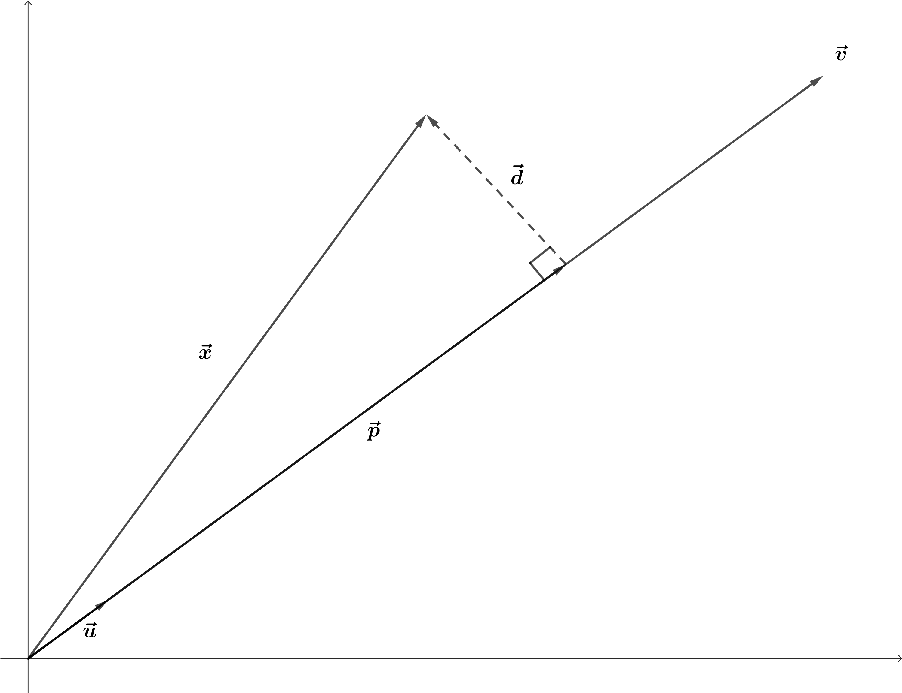

# Hello bookdown

All chapters start with a first-level heading followed by your chapter title, like the line above. There should be only one first-level heading (`#`) per .Rmd file.

## A section

All chapter sections start with a second-level (`##`) or higher heading followed by your section title, like the sections above and below here. You can have as many as you want within a chapter.

### An unnumbered section {.unnumbered}

Chapters and sections are numbered by default. To un-number a heading, add a `{.unnumbered}` or the shorter `{-}` at the end of the heading, like in this section.

### Derivation of projection operator

(\#fig:unnamed-chunk-1)Projection operator

We can create a unit vector as $\vec{u}=\frac{\vec{v}}{\|\vec{v}\|}$ in which we know that $\|u\|=1$

We know,
$$\vec{p}+\vec{d}=\vec{x}$$
or rearranging we get,
$$\vec{d}=\vec{x}-\vec{p}$$

Let $\vec{p}=k\vec{u}$
so
$$\vec{d}=\vec{x}-k\vec{u}$$
